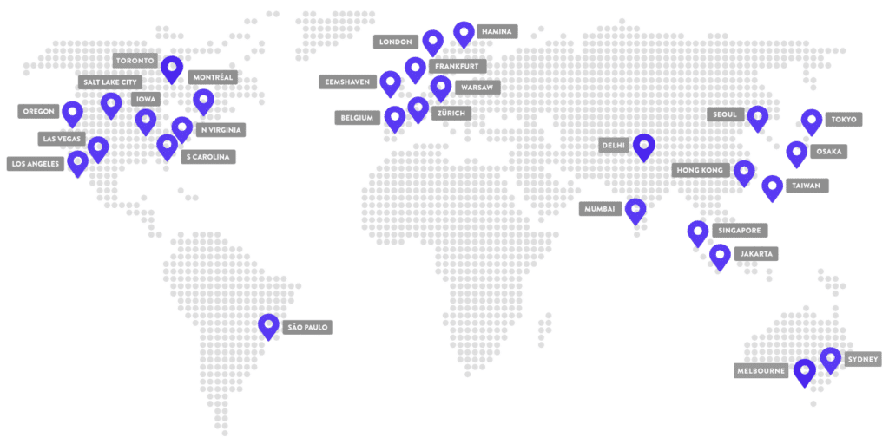

# Google Cloud

Klara Hermann, Anne Kreppenhofer, Matteo Marincek & Florian Safer

[TOC]

## Was ist Google Cloud

Die Google Cloud Platform (*Google Cloud*) [2] ist eine Plattform, die über 90 verschiedene IT-Services (auch Produkte genannt) bereitstellt. Diese Services können Unternehmen, IT-Experten und Entwickler zum effizienteren Arbeiten nutzen oder für das Erreichen strategischer Vorteile einsetzen.

Cloud Computing ermöglicht heute den Betrieb und die Nutzung von Hardware und Software in der Ferne (in Rechenzentren, deren Standort nahezu beliebig sein kann) und in fast jeder Größe. Zusammen liefern die Systeme, Geräte und Softwareprodukte spezifische Dienstleistungen. In der Regel können Benutzer über eine Web-Schnittstelle auf die benötigten Services zugreifen, diese verwalten und nutzen – das trifft auch bei den Services auf Google Cloud zu.

Mit dem Zugang zu den Services werden die Anwender in ihren Geschäfts- und IT-Prozessen außerdem flexibler. In der Google Cloud stehen den Anwendern verschiedenste Nutzungsarten zur Auswahl zur Verfügung: Jeder Dienst ist sofort richtig konfiguriert verfügbar. Die Nutzer können bei Google ganz verschiedene Ressourcen nutzen, gerade so, wie sich der Bedarf für die benötigte Infrastruktur entwickelt.

Wenn man mit der Google Cloud abreitet, kann man sich ein Projekt anlegen, welches über eine webbasierte Konsole zur Verfügung gestellt wird. Dabei hat man auch die Möglichkeit, die Zugriffe von Teammitgliedern und Administratoren als Projekt-Eigentümer verwalten. [1]

## Preise

Um genauere Preisinformationen zu bekommen, muss man ein Angebot an Google Cloud schicken und es anfordern.

Es gibt aber für Neukunden ein Guthaben von 300 Dollar, um Arbeitslasten auszuführen, zu testen und bereitzustellen und man kann innerhalb eines Nutzungslimit mehr als 20 Produkte kostenlos nutzen (genaue Liste hier [3]).

Mit dem "Pay as you go" Preisen von Google Cloud bezahlt man nur für die Dienste, die man nutzt. Keine Vorabkosten, keine Kündigungsgebühren.

Mit Google Cloud profitiert man im Vergleich zu anderen Anbietern von automatischen Einsparungen. Diese basieren auf der monatlichen Nutzung und der Vorauszahlung für Ressourcen mit entsprechenden Rabatten.

Außerdem bietet Google Cloud einen Preisrechner [5] an, mit dem man nachvollziehen kann, wie die Kosten aufgrund von Standort, Arbeitslast und anderen Variablen fluktuieren. [4]

## Lösungen

Google Cloud bietet verschiedene Lösungen für verschiedene Bereich an.

### Branchenlösungen

Wie schon etwas weiter oben erwähnt, bietet Google Cloud in verschiedenen Geschäftsfeldern Cloud-Lösungen an, welche die Effizienz und Agilität eines Unternehmens verbessern, Kosten senken und neue Geschäftsmodelle ermöglichen.

Dies ist eine kleine Auswahl an Branchen, die in Google Cloud spezifisch unterstützt werden [1]:

- Einzelhandel
- Verbrauchsgüter
- Fertigung
- Automobil
- Lieferkette und Logistik
- Energie
- Gesundheitswesen und Biowissenschaften
- Lösungen für das Gesundheitswesen in Zeiten des Coronavirus
- Medien und Unterhaltung
- Gaming
- Telekommunikation
- Finanzdienstleistungen
- Behörden und öffentlicher Sektor

### Anwendungsmodernisierung

Weiters bietet Google Cloud cloudnative Technologien wie Container und serverlose Datenverarbeitung an [2]:

- Hybrid- und Multi-Cloud-Anwendungsplattform
- Serverlose Lösungen
- Hosting
- DevOps

### Künstliche Intelligenz

Googles künstliche Intelligenz bei der Suchmaschine ist sehr bekannt. Das Wissen dahinter kann man in der Google Cloud für das eigene Unternehmen für bessere Informationsgewinnung und höhere Effizienz verwenden [3]:

- Data Science
- Intelligente Produkte
- KI entwickeln und verwenden

### Datenbanken

Natürlich bietet Google Cloud verschiedene Lösungen für Datenbanken an [4]:

- Datenbankmigration
- Datenbankmodernisierung
- Open-Source-Datenbanken
- SQL Server in Google Cloud

### Modernisierung der Infrastruktur

Google Cloud möchte in naher Zukunft der größte Cloud-Anbieter sein. Dafür stellt er verschiedene Lösungen für die Modernisierung der Infrastruktur zur Verfügung, um auch mit anderer Software in der Google Cloud zurechtzukommen [5]:

- Backup und Notfallwiederherstellung
- Rechenzentrumsmigration
- Hochleistungs-Computing
- SAP in Google Cloud
- Virtuelle Desktops
- Windows in Google Cloud

### Sicherheit

Passend zu deren Sicherheitsvorteilen, bietet Google Cloud auch für Unternehmer Lösungen für das Erkennen von Onlinebedrohungen und dessen Schutz an [6].

### Start-Ups

Google Cloud bietet extra für Start-Ups und kleine Unternehmen Lösungen an. Dabei gibt es Guthaben für Produkte, technische Schulungen sowie geschäftliche Chancen und Angeboten. Mit Google Cloud kann man alles auf die Anforderungen des Unternehmens anpassen und dadurch ein erfolgreiches, nachhaltiges Unternehmen aufbauen - mit intelligenter, kostengünstiger und bewährter Technologie. [7]

| Innovationen schneller und leichter realisieren              | Echtzeitinformationen aus Daten gewinnen                     | Zusammenarbeit von überall aus                               | Geld sparen                                                  |
| ------------------------------------------------------------ | ------------------------------------------------------------ | ------------------------------------------------------------ | ------------------------------------------------------------ |
| Geschwindigkeit ist für das Wachstum von Start-ups von entscheidender Bedeutung. Mit den hochmodernen Containern und Mikrodiensten von Google Cloud kann man die App-Entwicklung optimieren und Code in Rekordzeit schreiben und in der Produktion bereitstellen. | Mit hochmodernen Datenanalysen und KI-Lösungen wie BigQuery, Looker und AI Platform gewinnt man wertvolle Informationen und verbessert die Entscheidungsfindung. | Dank Google Workspace kann man mit dem Team in Echtzeit zusammenarbeiten, zum Beispiel mit Gmail, Drive, Google Meet und mehr - unterstützt durch die zuverlässige Sicherheitsinfrastruktur von Google. | Durch unsere einfache, sichere und zuverlässige Plattform von Google Cloud mit 99,99 % Verfügbarkeit kann man das Risiko senken, die betriebliche Effizienz erhöhen und so weitere Kosten sparen. |

## 

## Vorteile

### Data Cloud

Viele Unternehmen geben an, dass sie immer noch keinen greifbaren und messbaren Mehrwert aus Daten erkennen können. Deswegen vereint Google Cloud mit einer branchenweit einzigartigen einheitlichen Datenplattform Daten und Software miteinander und erstellt eine Data Cloud. KI/ML ist eine Kernkomponente der Daten-Cloud-Lösung, mit der man nicht nur bessere Informationen gewinnen, sondern auch Kern-Geschäftsprozesse mithilfe von Daten als Kern automatisieren können.

Google Cloud ist offen und standardbasiert. Es bietet Integration mit Open-Source-Standards und -APIs, so wird die Portabilität und Erweiterbarkeit gewährleistet, um eine Anbieterabhängigkeit zu verhindern.

Google wurde auf einer wegweisenden KI-Forschung errichtet und auf dem Grundsatz, dass die Informationen der Welt für Menschen und Unternehmen überall nutzbar gemacht werden. Das wird auch in der Google Cloud genutzt, denn damit erhalten Data Scientists, Datenanalysten und ML Engineers Zugriff auf dasselbe Toolkit, das von Google selbst verwendet wird, um Geschäftsergebnisse jeder Größenordnung steigern zu können. [6]

### Multi Cloud

Google Cloud bietet die Flexibiltät, Anwendungen in Hybrid- und Multi Cloud-Umgebungen zu migrieren, zu erstellen, zu optimieren und gleichzeitig Anbieterabhängigkeit zu reduzieren, branchenführende Lösungen zu nutzen und behördliche Anforderungen zu erfüllen.

Mit der Google Cloud kann man bis zu 1 Petabyte an Daten mithilfe einer hoch skalierbaren, kostengünstigen und sicheren Data-Warehouse-Lösung ([BigQuery](https://cloud.google.com/bigquery) genannt).

Auch bietet Google Cloud Kubernetes und eine serverlose Plattform an, um zugeschnittene containerbasierte Anwendungen schneller erstellen zu können, sowohl in Cloud-Umgebungen als auch lokal.

Google ist einer der größten Mitwirkenden für das Open-Source-System und arbeitet mit der Open-Source-Community zusammen, um bekannte Open-Source-Technologien wie Kubernetes zu entwickeln und dann als verwaltete Dienste bereitzustellen. So erhalten Nutzer maximale Wahlfreiheit und eine erhöhte Langlebigkeit und Verlässlichkeit Ihrer IT-Investitionen. [7]

### Nachhaltigkeit

Als einziger großer Cloud-Anbieter ist Google Cloud CO2-neutral, der verwendete Strom stammt zu 100 % aus erneuerbaren Energiequellen.

Mit der Einführung der CO2-Bilanz in Google Cloud kann man als Benutzer die CO2-Emissionen im Zusammenhang mit der Cloud messen, nachverfolgen und entsprechende Berichte erstellen.

Innerhalb von sechs Jahren hat sich in Sachen Nachhaltigkeit in der Google Cloud viel getan - sie ist jetzt doppelt so energieeffizient und bietet 7x mehr Rechenleistung für die gleiche Strommenge. Abfall und Umweltverschmutzung wird vermieden und die Google Cloud hält Materialien in Gebrauch und fördert nachhaltigere Lieferketten.

Google sagt von sich selbst: „Wir stellen uns den Herausforderungen des Klimawandels und der Notwendigkeit der Ressourceneffizienz. Darum möchten wir jeden befähigen, mithilfe von Google-Technologie eine nachhaltigere Welt zu schaffen. Das gilt für Unternehmen, staatliche und gemeinnützige Organisationen, Gemeinden und auch Einzelpersonen.“ [10]

| Daten | Beschreibung                                                 |
| ----- | ------------------------------------------------------------ |
| 90 %  | Abfälle, die nicht auf Deponien abgelagert werden            |
| 100 % | erneuerbare Energie für alle Cloud-Regionen                  |
| 2x    | effizienter als herkömmliche Unternehmensrechenzentren       |
| 1.1   | PUE-Wert (Power Usage Effectiveness: Effizienz der Stromnutzung) |

### Vertrauen und Sicherheit

Google Cloud schützt Daten, Anwendungen, Infrastruktur sowie Kunden mithilfe derselben Infrastruktur- und Sicherheitsdienste, die auch Google nutzt, vor betrügerischen Aktivitäten, Spam und Missbrauch. Die Netzwerk-, Datenspeicher- und Computing-Dienste von Google Cloud sorgen für die Verschlüsselung von ruhenden sowie aktiven Daten und von Daten bei der Übertragung. Dafür baut ein Stack die Sicherheit durch progressive Schichten auf, um einen tief greifenden Schutz im großen Maßstab zu bieten.

Daten werden bei der Übertragung an Google Cloud Einrichtungen verschlüsselt und können nur von autorisierten Rollen und Diensten mit überwachten Zugriff aufgerufen werden. [12]

Weiters besitzt Google Cloud viele Zertifikate im Bereich Cloud Compliance und hat folgenden Vertrauensgrundsatz [8]:

1. Eigentümer der Daten ist der Kunde, nicht Google
2. Google verkauft die Daten nicht an Dritte
3. Google Cloud verwendet Kundendaten nicht zu Werbezwecken
4. Alle Kundendaten sind standardmäßig verschlüsselt
5. Google schützt die Daten vor Insiderzugriffen
6. Google gewährt keiner Behörde „Backdoor”-Zugriff
7. Googles Datenschutzverfahren werden anhand internationaler Standards geprüft

### Google Workspace

Natürlich funtktioniert die Google Cloud wunderbar mit anderen Diensten von Google zusammen, wie Gmail, Google Calender, Google Drive, Google Meet, Google Docs, ... [10]

### Kosten- und Effizienzoptimierung

Laut einer TechValidate-Umfrage stimmen 86 % der Kunden von Google Cloud der folgenden Aussage zu: „Mit Google Cloud konnten wir unsere Betriebseffizienz erhöhen und unsere IT-Ausgaben optimieren.“ [6]

### Branchenspezifische Lösungen

Google Cloud unterstützt den digitalen Wandel bei weltweit führenden Unternehmen in den Bereichen Einzelhandel, Finanzdienstleistungen, Fertigung, Medien, Gaming, Unterhaltung und Telekommunikation sowie im öffentlichen Sektor und im Gesundheitswesen. Ein bekanntes Beispiel ist Procter & Gamble (P&G). [5]

## Geschichte

Google Cloud ist heut zutage eine Plattform die von Möglichkeiten nicht eingeschränkt wird. Google bietet dabei die verschiedenesten Sachen an wie IaaS, PaaS und servlose Computerumgebungen. Trotzdem liegt nur auf Platz 3 bei den größten Cloud-Anbietern, wenn man sich die Geschichte es er gibt sich ganz klar.

### Timeline

#### 2008

Im **April** brachte Google uns die App Engine. Diese war damals ein Tool, welches nur für ein paar Developer zur Verfügung stand, welches den Zweck erfüllt hat Web Applikationen auf der Google Infrastruktur zu laufen. Damals waren Applikation nur in Python kompatibel.

Im **Mai** wurde die App Engine geöffnet für alle Developer um sich anzumelden.

#### 2009

Im **Februar** hat Google Developer erlaubt weitere computing resourcen zu kaufen.

Im **April** wurde angekündigt, dass auf der App Engine nun auch Java unterstützt wird.

#### 2010

Im **Mai** wurde "Cloud Storage" gestartet und die App Engine "for Business" angekündigt, welche Management und Support Features speziell für "Enterprise" zugeschnitten ist. Zusätzlich wurde auch noch BigQuery und Prediction API angekündigt, aber nur in einer limitierten Preview.

#### 2011

Im **Oktober** wurde Cloud SQL angekündigt, wobei es als eine "fully-managed cloud based" relationale Datenbank vorgestellt wurde, als Service für App Engine.

Im **November** wurde die App Engine offiziel veröffentlicht und wurde somit ein “fully supported Google product”.

#### 2012

Im **März** wurde die erste stabile Version von GO veröffentlicht, zusätzlich auch noch eine App Enigine SDK für Go.

Im **April** hat Google angekündigt ihre Policy zu verändern bei allen Developer Produkten. Wobei bei App Engine die deprecation Periode auf ein Jahr gesetzt wurde und BigQueury General Availabil (GA).

Im **Juni** wurde App Engine erstmals für non-US cluster geöffnet, dabei wurde es in der EU für eine limitierte Anzahl an Benutzern zur Verfügung gestellt. Compute Engine wurde gelaunchet.

Im **Juli** hat Google "[Google Cloud Platform Partner Program](https://cloud.googleblog.com/2012/07/introducing-google-cloud-platform.html)" gelaunchet.

Im **Oktober** hat App Engine eine große Auslastung verspürt die auch Tumblr und Dropbox betroffen haben.

#### 2013

Im **Februar** wurde ein support packages gelauncht, diese ist für GCP und hat Optionen für 24x7 phone suppot und TAM (Technical Account Manager)

Nach 12 Monaten Preview wurde im **Mai** Computer Engine veröffentlicht. Zusätzlich wurde im Mai auch eine PHP Unterstützung für App Engine angekündigt und in einer limited Preview zur Verfügung gestellt.

Im **August** wurde begonnen, dass sich der Cloud Storage automatishc verschlüsseöt für jedes Storage Objekt.

Im **Oktober** wurde der PHP support auf der App Engine für alle zur Verfügung gestellt.

Im **November** wurde nach 18 Monaten Cloud Endpoints GA zusammen mit Mobile Backend Starter Kit.

#### 2014

Im **März** wurden APIs Client Library for .NET GA. Weiters wurde auch eine Preisverringerung angekündigt und es werden angekündigt [Managed Virtual Machines](https://cloudplatform.googleblog.com/2014/03/bringing-together-best-of-paas-and-iaas.html) and [BigQuery Streaming](https://cloud.googleblog.com/2013/09/stream-your-data-into-bigquery-in-real.html).

Im **April** wurden Computer Engine zones, Cloud Storage und Cloud SQl geöffnet für [Asia Pacific](https://cloudplatform.googleblog.com/2014/04/google-cloud-platform-expands-to-asia-pacific.html)[²³](http://www.eweek.com/cloud/google-cloud-platform-now-available-to-asia-pacific-customers.html).

Im **Mai** wurde die Cloud Storage JSON API GA . [Stackdriver is acquired](http://www.silicontap.com/Google_Buys_Stackdriver/s-0054929.html) und wurde ein Teil von GCP

Im **Juni** ist vie passiert. Kubernetes wurde gelaunchet zusmamen mit weiterentwickelten Docker Images. HTTP Loas Balancing und SSD-based Persistent Disk wurden angekündigt. Zu guter Letzt wurde auch noch Cloud Dataflow in der Limited Preview angekündigt.

Im **Juli** sind Microsoft, RedHat, IBM, Docker, Mesosphere, CoreOS und SaltStack der Kubernetes Community gejoint.

Im **August** wurde SSD Persistent Disk GA.

Im **Oktober** wurde Firebase

**October 2014** — [Firebase is acquired](https://techcrunch.com/2014/10/21/google-acquires-firebase-to-help-developers-build-better-realtime-apps/) and becomes part of GCP.

**October 2014** — GCP [commits to standardized naming](https://cloudplatform.googleblog.com/2014/10/new-release-phases-for-google-cloud.html) for release process: Beginning with “Alpha” for testing by a select group of customers, followed by “Beta” which is publicly available to to all customers, and finally “General Availability” at which point they gain an [SLA](https://en.wikipedia.org/wiki/Service-level_agreement) and full support[²⁸](https://gigaom.com/2014/10/03/googles-new-way-of-naming-not-ready-for-primetime-products-should-make-developers-happy/).

**November 2014** — [Alpha release of Container Engine](https://cloudplatform.googleblog.com/2014/11/unleashing-containers-and-kubernetes-with-google-compute-engine.html), a Kubernetes-powered, fully-managed cluster manager for Docker containers[²⁹](https://www.infoq.com/news/2014/11/google-cloud-container-engine). Managed VMs, Local SSDs, and Compute Engine Autoscaler [go into Beta](http://www.forbes.com/sites/benkepes/2014/11/04/you-couldnt-be-more-serious-about-enterprise-cloud-googles-long-list-of-announcements/#16bf63104934).

## Technischer Aufbau

### Server

Google Cloud hat zahlreiche Serverfarmen, verteilt auf der ganzen Welt, mit Ausnahme von Afrika. Speziell in Europa und Nordamerika kann man sehr viele dieser Farmen finden.

### SPI Model

Das SPI Model lässt sich in die 3 Teile IaaS (Infrastructure as a Service), PaaS (Planform as a Service) und SaaS (Software as a Service) aufteilen. Dienste in allen 3 Bereichen kann man in der Google Cloud finden.

#### IaaS

Die grundlegende Ebene des Cloud-Computings ist IaaS, denn hier werden Hardware-Ressourcen in virtualisierter Form bereitgestellt. Ob Speicherplatz, Prozessoren oder Netzwerk – alle Recheninstanzen können in beliebiger Menge hinzugefügt und auch wieder entfernt werden. Manchmal wird deswegen auch von einem virtuellen Rechenzentrum (Virtual Data-Center) gesprochen.

Bei IaaS kommen die Kostenvorteile des Cloud-Computings wohl am deutlichsten zum Tragen: Gerade Hardware ist in der Anschaffung sehr teuer, veraltet schnell und sollte zudem unter besonders gesicherten Bedingungen (Stichwort: Rechenzentrum vs. Unternehmenskeller) aufgestellt werden. Findet die Bereitstellung der IT-Ressourcen virtualisiert und bedarfsgerecht statt, sparen Anwender in der Regel enorm.

#### PaaS

PaaS ist das Bindeglied zwischen IaaS und SaaS und ermöglicht erst das Zusammenspiel der beiden anderen Ebenen. Denn auf der Plattformebene werden die Entwicklungs- und Laufzeitumgebungen für Software bereitgestellt, aufbauend auf IaaS-Ressourcen wie etwa Betriebssystemen. Die anderen beiden Ebenen IaaS und SaaS werden in der Regel durch APIs angesprochen. Für PaaS interessieren sich demzufolge vor allem Software-Entwickler.

#### SaaS

SaaS geht noch einen Schritt weiter: Alles ist über das Web verfügbar. Der Anbieter hostet, verwaltet und liefert die gesamte Infrastruktur inklusive Anwendungen. Die Benutzer melden sich einfach in der Cloud an, um auf die als Service bereit gestellten Ressourcen zuzugreifen. Solche Service können eine Anwendungssoftware oder IT-Lösungen wie z.B. Backup- und Recovery-Tools sein.

Eine weitere Möglichkeit, durch das vielfältige Angebot an Lösungen der Google Cloud Platform zu navigieren, ist die Auswahl von Services. Zu den wichtigsten Kategorien an Services gehören:

- Compute Leistung
- Computer Vernetzung
- Datenspeicher und Datenbanken
- Künstliche Intelligenz und Machine Learning
- Big Data
- Identifizierung und Sicherheit
- Management Tools

Die wichtigsten Dienstleistungen im Bereich SaaS sind:

| Compute            | Networking                   | Storage & Databases       | AI & ML                | Big Data        | Identity & Security    | Management Tools         |
| ------------------ | ---------------------------- | ------------------------- | ---------------------- | --------------- | ---------------------- | ------------------------ |
| Computer Engine    | Google Cloud Virtual Network | Cloud Storage             | Cloud Machine Learning | Big Query       | Google Cloud IAM       | Stackdriver              |
| App Engine         | Cloud Load Balancing         | Cloud SQL                 | Cloud Vision API       | Cloud Dataflow  | Cloud Resource Manager | Deployment Manager       |
| Container Engine   | Cloud CDN                    | Bigtable                  | Cloud Speech API       | Dataproc        | Cloud Security Scanner | Cloud Shell              |
| Container Registry | Google Cloud Interconnect    | Cloud Datastore           | Natural Language API   | Cloud Datalab   |                        | Google Cloud Billing API |
| Cloud Functions    | Cloud DNS                    | Cloud Spanner             | Translate API          | Google Genomics |                        |                          |
| Cloud Pub/Sub      |                              | Persistant Disk           |                        |                 |                        |                          |
|                    |                              | Cloud Source Repositories |                        |                 |                        |                          |

##### Kuberenetes

| Entwicklung von Anwendungen beschleunigen, ohne die Sicherheit zu gefährden | Vorgänge mit Release- Versionen optimieren                   | Vorgänge am 2. Tag mithilfe von Google SREs reduzieren       |
| ------------------------------------------------------------ | ------------------------------------------------------------ | ------------------------------------------------------------ |
| Entwickeln Sie unterschiedlichste Anwendungen, die Unterstützung für zustandsorientierte, serverlose und Anwendungsbeschleuniger bieten. Sichern und beschleunigen Sie mit Kubernetes-eigenen CI/CD-Tools jede Phase des Erstellungs- und Bereitstellungszyklus. | Wählen Sie die Release-Version, die Ihren Unternehmensanforderungen entspricht. Schnelle, regelmäßige und stabile Release-Versionen haben unterschiedliche Rhythmen für Knoten-Upgrades und bieten Supportstufen, die der jeweiligen Version entsprechen. | Dank der Site Reliability Engineers (SREs) von Google sparen Sie Zeit und können sich ganz auf Ihre Anwendungen konzentrieren. Unsere SREs haben Ihren Cluster und seine Computing-, Netzwerk- und Speicherressourcen ständig im Blick. |

Quelle: https://cloud.google.com/kubernetes-engine

Google Kubernetes bietet 2 Betriebsarten:

- Standard: Bei dieser Form werden alle Container vom Benutzer verwaltet und administriert. Der Benutzer kann neue Container erstellen und diese auch wieder löschen, wenn sie nicht mehr benötigt werden
- Autopilot: Beim Autopilot haben die Benutzer keinen Zugriff auf die Verwaltung der Container. Der Modus übernimmt die komplette Verwaltung der Clusterinfrastruktur, ohne dass sich der Nutzer um Monitoring und konfigurieren kümmern muss.

##### Anthos

Doch Google Kubernetes selbst ist heutzutage nicht mehr für alle "der Way to go". Google hat mittlerweile einen viel umfangreicheren Dienst, der viele der altbekannten Dienste zu einem kombiniert, nämlicht Anthos Vorteile von Anthos:

| Anwendungen überall verwalten                                | Software schneller bereitstellen                             | Anwendungen und Softwarelieferkette schützen                 |
| ------------------------------------------------------------ | ------------------------------------------------------------ | ------------------------------------------------------------ |
| Anthos ist eine verwaltete Plattform für alle Ihre Anwendungs-Deployments, sowohl traditionelle als auch cloudnative. Sie können damit globale Flotten aufbauen und verwalten sowie Betriebskonsistenz übergreifend über diese schaffen. | Mit cloudnativen Tools und Anleitungen von Google können Sie die Produktivität Ihrer Entwickler und die Softwarebereitstellung beschleunigen, indem Sie die Vorteile von Cloud-Dienste, Container und serverloses Computing übergreifend für Ihre Bereitstellungen nutzen. | Sicherheit wird mit Anthos in jeder Phase des Lebenszyklus von Anwendungen integriert, d. h. während der Entwicklung, Erstellung und Ausführung. Die Sicherheits- und Richtlinienverwaltung erfolgt für alle Ihre Deployments automatisch. |

Quelle: https://cloud.google.com/anthos?hl=de

Mit diesem System umgeht Google das Problem, dass manche Anwendungen nicht mit allen Systemumgebungen kompatibel sind. Google beschreibt Anthos wie folgt: "Anthos ist eine offene Hybrid- und Multi-Cloud-Plattform, auf der Sie bestehende Anwendungen modernisieren, neue entwickeln und diese überall sicher ausführen können. Anthos basiert auf Open-Source-Technologien, die von Google federführend entwickelt wurden, darunter Kubernetes, Istio und Knative." Somit spart man sich die Anwendung vieler kleinerer Cloud Dienste und vereint sie somit zu einem Dienst.

## Vergleich zu anderen Produkten

In den folgenden Seiten soll Bezug auf die Konkurrenz auf sowohl wirtschaftlicher sowie technischer Ebene genommen werden. Hierbei wird *Google Cloud* zumeist mit *Microsoft Azure* [kurz *Azure*] und *Amazon Web Services* [kurz *AWS*] verglichen, da diese zusammen mit *Google Cloud* die größten und marktfähigsten Produkte dieser Branche sind. Es wird bewusst auf eine Gegenüberstellung mit *Alibaba Cloud*oder *Oracle Analytics Cloud* verzichtet da diese - wie erkennbar an der folgenden Grafik zum Zeitpunkt der Erstellung dieses Vergleichs noch Nischenprodukte sind.

### Wirtschaft

#### Etablissement

Als Tochtergesellschaft von *amazon.com* war *AWS* bereits 2006 ein Anbieter für Cloud Dienste wie *Elastic Compute Cloud* oder *Simple Storage Service*. 2009 wurden bereits bestehende Produkte in *AWS* integriert und die Nutzerbasis, welche aus Firmen und Privatpersonen besteht, wurde nicht kleiner.

Microsoft legte 2010 mit *Azure* - einer Cloud Computing Platform für Firmen - nach. Durch die gute Integration in die in vielen Firmen bereits vorhandene *Windows* Architektur gewann *Azure*, welches 2014 den Namen zum heutigen *Microsoft Azure* änderte, schnell an Kunden.

Die *Google Cloud Platform* war ursprünglich die Umgebung, auf der *Google*'s Produkte verwaltet wurden. Dies änderte sich bis heute nicht, jedoch wurde der Service seit 2011 auch Unternehmen bereitgestellt und machte so *Google* Profit - sowohl im finanziellen als auch im technischen Sinne.

#### Globale Infrastruktur

Mit 81 Availability Zones, welche sich über 245 Länder und Gebiete erstrecken, ist *Amazon Web Services* der wortwörtlich erreichbarste Dienst. Die 99.99% Uptime, die Kunden bei Nutzen des Dienstes von *amazon* versichert wird, werden jedoch oft nicht eingehalten. In Foren wird von einem "inherently unstable" [inhärent instabilen] Service gesprochen, der jedoch von offizieller Seite - vermutlich aus Marketinggründen - nicht bestätigt wird. Derzeit wird die Uptime im Durchschnitt auf etwa 99% geschätzt, nachweisbar ist dies jedoch nicht.

*Azure* rüstet indes mit 54 Regionen, welche 140 Ländern Zugang zum Produkt gewähren, auf. Auch Österreich soll 2024 ein eigenes Datenzentrum erhalten, wie im Oktober 2020 bekannt gegeben wurde. In puncto Uptime prallt *Microsoft* mit Transparenz und macht jeden Ausfall seit 2019 öffentlich. So lässt sich auch eine halbwegs genaue Angabe von ungefähr 99.9% Uptime tätigen.

*Google* ist auch in diesem Punkt mit 22 Regionen auf über 100 Länder verteilt erst im Aufbau der Infrastruktur, aber dennoch gut am globalen Markt vertreten. Auch die Uptime kann mit *Microsofts* Produkt konkurrieren, doch ob Google in Zukunft bei steigenden Kundenzahlen diese halten kann, steht noch in den Sternen.

#### Marktanteil & Zuwachsrate

Der Wert der Aktien von *AWS* lag im ersten Quatal 2021 bei 13,5 Mil. USD und wuchs relativ zum Vorquatal um 32%. Damit hat *AWS* gerade so die Werte von *Azure* aus dem Vorquatal gekankt, welche nun mit einem Wachstum von 50% bei 17.7 Mil. USD liegt. *GCP* ist erneut etwas abgeschlagen auf Platz 3 mit 4.05 Millionen und einem Wachstum von 46%.

### Technologie

Alle drei Produkte im Vergleich bauen auf Services auf, die der Plattform nach und nach hinzugefügt werden. Dadurch ist es bedingt, dass das älteste Produkt mit über 200 Services auch am meisten Umfang bietet. Es folgt eine kurze Auflistung an Diensten, die jede Plattform zur Verfügung stellt.

#### Geläufige Services

##### Housing

| **Services**             | **AWS**                                        | **Azure**                      | **GCP**                  |
| ------------------------ | ---------------------------------------------- | ------------------------------ | ------------------------ |
| **IaaS**                 | Amazon Elastic Compute Cloud                   | Virtual Machines               | Google Compute Engine    |
| **PaaS**                 | AWS Elastic Beanstalk                          | App Service and Cloud Services | Google App Engine        |
| **Containers**           | Amazon Elastic Compute Cloud Container Service | Azure Kubernetes Service (AKS) | Google Kubernetes Engine |
| **Serverless Functions** | AWS Lambda                                     | Azure Functions                | Google Cloud Functions   |

##### Datenbanken

| **Services**         | **AWS**                            | **Azure**       | **GCP**                                     |
| -------------------- | ---------------------------------- | --------------- | ------------------------------------------- |
| **RDBMS**            | Amazon Relational Database Service | SQL Database    | Google Cloud SQL                            |
| **NoSQL: Key–Value** | Amazon DynamoDB                    | Table Storage   | Google Cloud DatastoreGoogle Cloud Bigtable |
| **NoSQL: Indexed**   | Amazon SimpleDB                    | Azure Cosmos DB | Google Cloud Datastore                      |

##### Speicher

| **Services**             | **AWS**                       | **Azure**                  | **GCP**                                |
| ------------------------ | ----------------------------- | -------------------------- | -------------------------------------- |
| **Object Storage**       | Amazon Simple Storage Service | Blob Storage               | Google Cloud Storage                   |
| **Virtual Server Disks** | Amazon Elastic Block Store    | Managed Disks              | Google Compute Engine Persistent Disks |
| **Cold Storage**         | Amazon Glacier                | Azure Archive Blob Storage | Google Cloud Storage Nearline          |
| **File Storage**         | Amazon Elastic File System    | Azure File Storage         | ZFS/Avere                              |

##### Networking Services

| **Services**              | **AWS**                            | **Azure**                | **GCP**                     |
| ------------------------- | ---------------------------------- | ------------------------ | --------------------------- |
| **Virtual Network**       | Amazon Virtual Private Cloud (VPC) | Virtual Networks (VNets) | Virtual Private Cloud       |
| **Elastic Load Balancer** | Elastic Load Balancer              | Load Balancer            | Google Cloud Load Balancing |
| **Peering**               | Direct Connect                     | ExpressRoute             | Google Cloud Interconnect   |
| **DNS**                   | Amazon Route 53                    | Azure DNS                | Google Cloud DNS            |

#### Nischenfüller

| Service                | AWS                                                          | Azure                                                        | GCP                                                          |
| ---------------------- | ------------------------------------------------------------ | ------------------------------------------------------------ | ------------------------------------------------------------ |
| **DevOps**             | CodePipeline, CodeBuild, CodeDeploy, CodeStar                | Azure Boards, Pipelines, Repos, Test Plans, Artifacts        | GCP DevOps CloudBuild, Artifact Registry                     |
| **AI & ML**            | Amazon SageMaker, Amazon Comprehend, Amazon Lex, Amazon Polly | Azure Machine Learning, Azure Databricks, Azure Cognitive Search, Azure Bot Service, Cognitive Services | Vertex AI, AutoML, Dataflow CX, Cloud Vision, Virtual Agents |
| **IoT**                | FreeRTOS, IoT Core, Greengrass, IoT Analytics, SiteWise      | Azure IoT Hub/Central, IoT Edge, Azure Sphere, Azure RTOS    | Google Cloud IoT Core                                        |
| **AR & VR**            | Amazon Sumerian                                              | Azure Mixed Reality (Spatial Anchors/Remote Rendering)       | ARCore                                                       |
| **Game Development**   | Amazon GameLift                                              | Azure PlayFab                                                | -                                                            |
| **Business Analytics** | Amazon Quicksight                                            | Azure Power BI                                               | Looker                                                       |
| **End-User Computing** | Amazon Workspaces                                            | Azure Virtual Desktop                                        | -                                                            |
| **Robotics**           | AWS RoboMaker                                                | -                                                            | -                                                            |

#### Preisleistung

*AWS* und *Azure* bieten beide Pay-per-Minute an, während *GCP* auf ein Pay-per-Second Model setzt. Das, gepaart mit den bis zu 50% hohen Rabatten, die Google in Verhandlungen mit Unternehmen bietet, macht *GCP* oft zum günstigsten Anbieter. Zudem kosten selbst ohne Rabatte sowohl die kleinsten Serverinstanzen (2 vCPUs & 8GB RAM) statt 70 bzw. 69 USD pro Monat nur 52$. Bei den größten Instanzen fluktuieren die Preise mehr. Sowohl *AWS* sowie *Azure* bieten über 3,8TB RAM und 128 vCPUs als mächtigstes Produkt, jedoch ist *Amazon* mit 3.97$ pro Stunde deutlich billiger als Microsoft mit 6.79$ die Stunde. *GCP* bietet indes 3.75TB und 160vCPUs für 5.32$/Stunde.

### Zusammenfassung

Im direkten Vergleich ist *AWS* aufgrund dessen Dominanz am Markt oftmals führend, doch die Integration in bereits bestehende Infrastruktur, die *MS Azure* und *Google Cloud Platform* bieten können, hat *Amazon Web Services* nicht. Die stetig steigende und schnell wachsende Präsenz am Markt wird bald amazon.com parole bieten können. Zusätzlich punktet *Google* mit ihrer Erfahrung in Gebieten wie AI und IoT, die zurzeit dabei ist, die *AWS*-seitige Implementierung in den Schatten zu stellen.

Alles in allem sollten sowohl *GCP* als auch Azure innerhalb des nächsten Jahrzehnts mit *AWS* auf einem Level konkurrieren können. Sobald das erreicht ist, wird es nur noch eine Frage der spezifischen Anwendung des Kunden sein, für welches Produkt er sich entscheidet.

## Fazit

Google Cloud bietet eine Vielzahl an Produkten, Lösungen und Diensten an, welche die Arbeit in Unternehmen erleichtern. Außerdem ist Google Cloud sehr auf Effizienz spezialisiert und versucht, als Cloud-Anbieter nachhaltig zu agieren und auch kleine Unternehmen und Start-Ups zu unterstützen.

Auch wenn es noch nicht der größte Cloud-Anbieter ist, steht Google Cloud durch sein großes Wissen über KI (dank der Google Suchmaschine) eine große Zukunft bevor.

## Quellen

[1] "Google Cloud-Plattform: Was es ist, wie man es benutzt und wie es verglichen wird"; Acronis; https://www.acronis.com/de-de/articles/google-cloud-platform/ (29.11.2021)

[2] "Google Cloud"; Google Cloud; https://cloud.google.com/ (29.11.2021)

[3] "Kostenlose Stufe"; Google Cloud - Dokumentation; https://cloud.google.com/free/docs/gcp-free-tier#free-tier (20.12.2021)

[4] "Google Cloud-Preise"; Google Cloud; https://cloud.google.com/pricing (20.12.2021)

[5] "Google Cloud Pricing Calculator"; Google Cloud; https://cloud.google.com/products/calculator (20.12.2021)

[6] "Data Cloud"; Google Cloud; https://cloud.google.com/data-cloud/ (20.12.2021)

[7] "Transformation mit Multi-Cloud-Lösungen von Google optimieren"; Google Cloud; https://cloud.google.com/multicloud (20.12.2021)

[8] "Branchenspezifische Lösungen"; Google Cloud; https://cloud.google.com/why-google-cloud (14.12.2021)

[9] "Geld sparen, die Effizienz steigern und die Kosten optimieren"; Google Cloud; https://cloud.google.com/why-google-cloud

[10] "Nachhaltigkeit bei Cloud"; Google Cloud; https://cloud.google.com/sustainability (14.12.2021)

[11] "Unsere Prinzipien in Bezug auf Vertrauen"; Google Cloud; https://cloud.google.com/security/transparency (14.12.2021)

[12] "Vertrauen und Sicherheit"; Google Cloud; https://cloud.google.com/security (14.12.2021)

[13] "Effizient im Team kommunizieren, Inhalte erstellen und zusammenarbeiten"; Google Workspace; https://workspace.google.com/(14.12.2021)