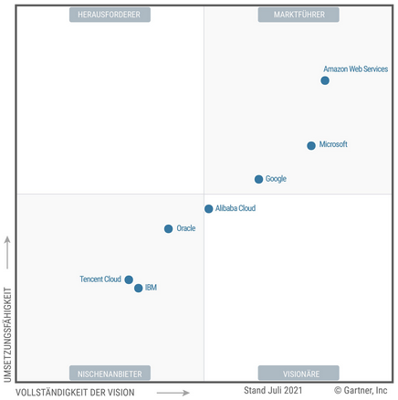

## Vergleich zu anderen Produkten

In den folgenden Seiten soll Bezug auf die Konkurrenz auf sowohl wirtschaftlicher sowie technischer Ebene genommen werden. Hierbei wird *Google Cloud* zumeist mit *Microsoft Azure* [kurz *Azure*] und *Amazon Web Services* [kurz *AWS*] verglichen, da diese zusammen mit *Google Cloud* die größten und marktfähigsten Produkte dieser Branche sind. Es wird bewusst auf eine Gegenüberstellung mit *Alibaba Cloud* oder *Oracle Analytics Cloud* verzichtet da diese - wie erkennbar an der folgenden Grafik zum Zeitpunkt der Erstellung dieses Vergleichs noch Nischenprodukte sind.

### Wirtschaft

#### Etablissement

Als Tochtergesellschaft von *amazon.com* war *AWS* bereits 2006 ein Anbieter für Cloud Dienste wie *Elastic Compute Cloud* oder *Simple Storage Service*. 2009 wurden bereits bestehende Produkte in *AWS* integriert und die Nutzerbasis, welche aus Firmen und Privatpersonen besteht, wurde nicht kleiner.

Microsoft legte 2010 mit *Azure* - einer Cloud Computing Platform für Firmen - nach. Durch die gute Integration in die in vielen Firmen bereits vorhandene *Windows* Architektur gewann *Azure*, welches 2014 den Namen zum heutigen *Microsoft Azure* änderte, schnell an Kunden.

Die *Google Cloud Platform* war ursprünglich die Umgebung, auf der *Google*'s Produkte verwaltet wurden. Dies änderte sich bis heute nicht, jedoch wurde der Service seit 2011 auch Unternehmen bereitgestellt und machte so *Google* Profit - sowohl im finanziellen als auch im technischen Sinne.

#### Globale Infrastruktur

Mit 81 Availability Zones, welche sich über 245 Länder und Gebiete erstrecken, ist *Amazon Web Services* der wortwörtlich erreichbarste Dienst. Die 99.99% Uptime, die Kunden bei Nutzen des Dienstes von *amazon* versichert wird, werden jedoch oft nicht eingehalten. In Foren wird von einem "inherently unstable" [inhärent instabilen] Service gesprochen, der jedoch von offizieller Seite - vermutlich aus Marketinggründen - nicht bestätigt wird. Derzeit wird die Uptime im Durchschnitt auf etwa 99% geschätzt, nachweisbar ist dies jedoch nicht.

*Azure* rüstet indes mit 54 Regionen, welche 140 Ländern Zugang zum Produkt gewähren, auf. Auch Österreich soll 2024 ein eigenes Datenzentrum erhalten, wie im Oktober 2020 bekannt gegeben wurde. In puncto Uptime prallt *Microsoft* mit Transparenz und macht jeden Ausfall seit 2019 öffentlich. So lässt sich auch eine halbwegs genaue Angabe von ungefähr 99.9% Uptime tätigen.

*Google* ist auch in diesem Punkt mit 22 Regionen auf über 100 Länder verteilt erst im Aufbau der Infrastruktur, aber dennoch gut am globalen Markt vertreten. Auch die Uptime kann mit *Microsofts* Produkt konkurrieren, doch ob Google in Zukunft bei steigenden Kundenzahlen diese halten kann, steht noch in den Sternen. 

#### Marktanteil & Zuwachsrate

Der Wert der Aktien von *AWS* lag im ersten Quatal 2021 bei 13,5 Mil. USD und wuchs relativ zum Vorquatal um 32%. Damit hat *AWS* gerade so die Werte von *Azure* aus dem Vorquatal gekankt, welche nun mit einem Wachstum von 50% bei 17.7 Mil. USD liegt. *GCP* ist erneut etwas abgeschlagen auf Platz 3 mit 4.05 Millionen und einem Wachstum von 46%.

### Technologie

Alle drei Produkte im Vergleich bauen auf Services auf, die der Plattform nach und nach hinzugefügt werden. Dadurch ist es bedingt, dass das älteste Produkt mit über 200 Services auch am meisten Umfang bietet. Es folgt eine kurze Auflistung an Diensten, die jede Plattform zur Verfügung stellt.

#### Geläufige Services

##### Housing

| **Services**             | **AWS**                                        | **Azure**                      | **GCP**                  |
| ------------------------ | ---------------------------------------------- | ------------------------------ | ------------------------ |
| **IaaS**                 | Amazon Elastic Compute Cloud                   | Virtual Machines               | Google Compute Engine    |
| **PaaS**                 | AWS Elastic Beanstalk                          | App Service and Cloud Services | Google App Engine        |
| **Containers**           | Amazon Elastic Compute Cloud Container Service | Azure Kubernetes Service (AKS) | Google Kubernetes Engine |
| **Serverless Functions** | AWS Lambda                                     | Azure Functions                | Google Cloud Functions   |

##### Datenbanken

| **Services**         | **AWS**                            | **Azure**       | **GCP**                                     |
| -------------------- | ---------------------------------- | --------------- | ------------------------------------------- |
| **RDBMS**            | Amazon Relational Database Service | SQL Database    | Google Cloud SQL                            |
| **NoSQL: Key–Value** | Amazon DynamoDB                    | Table Storage   | Google Cloud DatastoreGoogle Cloud Bigtable |
| **NoSQL: Indexed**   | Amazon SimpleDB                    | Azure Cosmos DB | Google Cloud Datastore                      |

##### Speicher

| **Services**             | **AWS**                       | **Azure**                  | **GCP**                                |
| ------------------------ | ----------------------------- | -------------------------- | -------------------------------------- |
| **Object Storage**       | Amazon Simple Storage Service | Blob Storage               | Google Cloud Storage                   |
| **Virtual Server Disks** | Amazon Elastic Block Store    | Managed Disks              | Google Compute Engine Persistent Disks |
| **Cold Storage**         | Amazon Glacier                | Azure Archive Blob Storage | Google Cloud Storage Nearline          |
| **File Storage**         | Amazon Elastic File System    | Azure File Storage         | ZFS/Avere                              |

##### Networking Services

| **Services**              | **AWS**                            | **Azure**                | **GCP**                     |
| ------------------------- | ---------------------------------- | ------------------------ | --------------------------- |
| **Virtual Network**       | Amazon Virtual Private Cloud (VPC) | Virtual Networks (VNets) | Virtual Private Cloud       |
| **Elastic Load Balancer** | Elastic Load Balancer              | Load Balancer            | Google Cloud Load Balancing |
| **Peering**               | Direct Connect                     | ExpressRoute             | Google Cloud Interconnect   |
| **DNS**                   | Amazon Route 53                    | Azure DNS                | Google Cloud DNS            |

#### Nischenfüller

| Service                | AWS                                                          | Azure                                                        | GCP                                                          |
| ---------------------- | ------------------------------------------------------------ | ------------------------------------------------------------ | ------------------------------------------------------------ |
| **DevOps**             | CodePipeline, CodeBuild, CodeDeploy, CodeStar                | Azure Boards, Pipelines, Repos, Test Plans, Artifacts        | GCP DevOps CloudBuild, Artifact Registry                     |
| **AI & ML**            | Amazon SageMaker, Amazon Comprehend, Amazon Lex, Amazon Polly | Azure Machine Learning, Azure Databricks, Azure Cognitive Search, Azure Bot Service, Cognitive Services | Vertex AI, AutoML, Dataflow CX, Cloud Vision, Virtual Agents |
| **IoT**                | FreeRTOS, IoT Core, Greengrass, IoT Analytics, SiteWise      | Azure IoT Hub/Central, IoT Edge, Azure Sphere, Azure RTOS    | Google Cloud IoT Core                                        |
| **AR & VR**            | Amazon Sumerian                                              | Azure Mixed Reality (Spatial Anchors/Remote Rendering)       | ARCore                                                       |
| **Game Development**   | Amazon GameLift                                              | Azure PlayFab                                                | -                                                            |
| **Business Analytics** | Amazon Quicksight                                            | Azure Power BI                                               | Looker                                                       |
| **End-User Computing** | Amazon Workspaces                                            | Azure Virtual Desktop                                        | -                                                            |
| **Robotics**           | AWS RoboMaker                                                | -                                                            | -                                                            |

#### Preisleistung

*AWS* und *Azure* bieten beide Pay-per-Minute an, während *GCP* auf ein Pay-per-Second Model setzt. Das, gepaart mit den bis zu 50% hohen Rabatten, die Google in Verhandlungen mit Unternehmen bietet, macht *GCP* oft zum günstigsten Anbieter. Zudem kosten selbst ohne Rabatte sowohl die kleinsten Serverinstanzen (2 vCPUs & 8GB RAM) statt 70 bzw. 69 USD pro Monat nur 52\$. Bei den größten Instanzen fluktuieren die Preise mehr. Sowohl *AWS* sowie *Azure* bieten über 3,8TB RAM und 128 vCPUs als mächtigstes Produkt, jedoch ist *Amazon* mit 3.97\$ pro Stunde deutlich billiger als Microsoft mit 6.79\$ die Stunde. *GCP* bietet indes 3.75TB und 160vCPUs für 5.32$/Stunde.

### Zusammenfassung

Im direkten Vergleich ist *AWS* aufgrund dessen Dominanz am Markt oftmals führend, doch die Integration in bereits bestehende Infrastruktur, die *MS Azure* und *Google Cloud Platform* bieten können, hat *Amazon Web Services* nicht. Die stetig steigende und schnell wachsende Präsenz am Markt wird bald amazon.com parole bieten können. Zusätzlich punktet *Google* mit ihrer Erfahrung in Gebieten wie AI und IoT, die zurzeit dabei ist, die *AWS*-seitige Implementierung in den Schatten zu stellen.

Alles in allem sollten sowohl *GCP* als auch Azure innerhalb des nächsten Jahrzehnts mit *AWS* auf einem Level konkurrieren können. Sobald das erreicht ist, wird es nur noch eine Frage der spezifischen Anwendung des Kunden sein, für welches Produkt er sich entscheidet.
